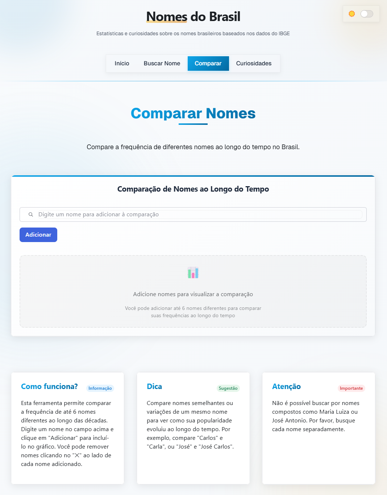
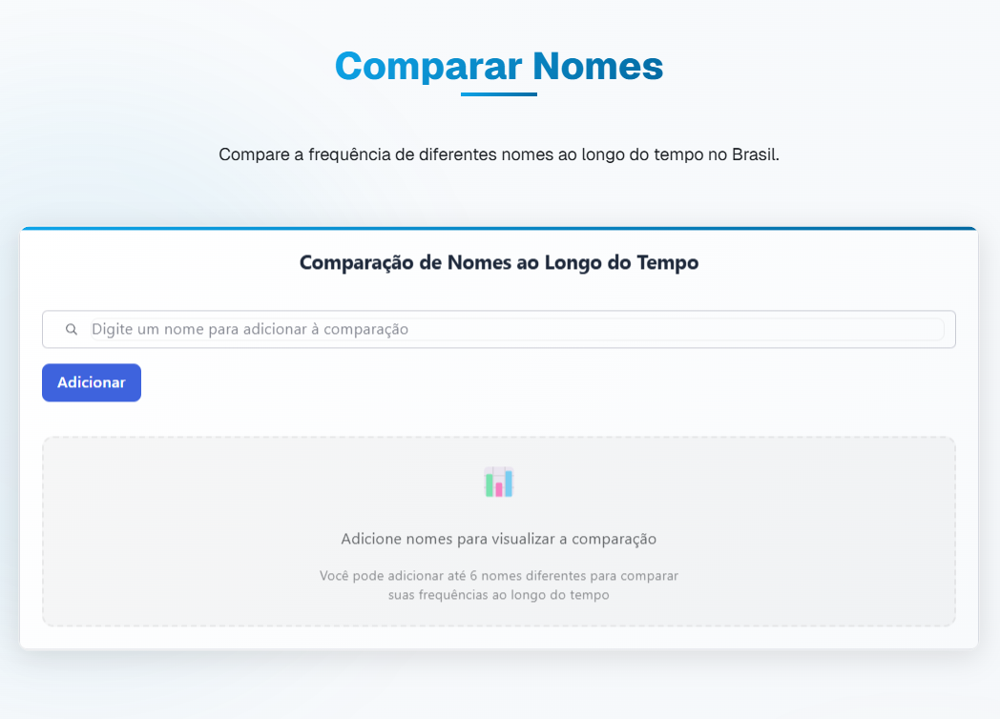

# Nomes do Brasil - Estatísticas e Curiosidades

[](https://nextjs.org/)
[](https://www.typescriptlang.org/)
[](https://www.radix-ui.com/)
[](https://recharts.org/)

Uma aplicação web interativa para explorar estatísticas e curiosidades sobre os nomes mais populares do Brasil, utilizando dados do IBGE.

## 📸 Screenshots

### Página Inicial


*Visão geral da página inicial mostrando os nomes mais populares do Brasil.*

### Busca de Nomes


*Interface de busca para encontrar estatísticas sobre um nome específico.*

### Comparação de Nomes


*Ferramenta de comparação que permite visualizar até 6 nomes diferentes em um gráfico.*

### Modo Escuro


*A aplicação também oferece um elegante modo escuro para uso noturno.*

## 🚀 Funcionalidades

- **Página Inicial**: Visualize os 10 nomes mais comuns no Brasil e estatísticas gerais.
- **Busca de Nomes**: Pesquise qualquer nome para ver sua frequência e evolução ao longo do tempo.
- **Comparação de Nomes**: Compare até 6 nomes diferentes em um único gráfico interativo.
- **Curiosidades**: Descubra fatos interessantes sobre os nomes brasileiros.
- **Modo Escuro/Claro**: Alterne entre os temas para melhor experiência visual.
- **Design Responsivo**: Interface adaptada para dispositivos móveis e desktop.

## 🔧 Tecnologias Utilizadas

- **Next.js**: Framework React para renderização do lado do servidor e geração de sites estáticos.
- **TypeScript**: Superset JavaScript tipado para desenvolvimento mais seguro.
- **Radix UI**: Biblioteca de componentes acessíveis e sem estilo para personalização flexível.
- **Recharts**: Biblioteca de gráficos construída com React e D3.
- **API do IBGE**: Fonte de dados oficial sobre nomes no Brasil.

## 📊 Sobre os Dados

Os dados utilizados nesta aplicação são provenientes da API de Nomes do IBGE (Instituto Brasileiro de Geografia e Estatística). Esta API fornece informações sobre a frequência e distribuição de nomes no Brasil ao longo das décadas, com base nos censos demográficos.

## 🛠️ Instalação e Uso

### Pré-requisitos

- Node.js (versão 18 ou superior)
- npm ou yarn

### Passos para Instalação

1. Clone o repositório:
   ```bash
   git clone https://github.com/FrancisBernard34/nomes-brasil.git
   cd nomes_brasil
   ```

2. Instale as dependências:
   ```bash
   npm install
   # ou
   yarn install
   ```

3. Inicie o servidor de desenvolvimento:
   ```bash
   npm run dev
   # ou
   yarn dev
   ```

4. Abra [http://localhost:3000](http://localhost:3000) no seu navegador para ver a aplicação.

## 🏗️ Estrutura do Projeto

```
nomes_brasil/
├── app/                  # Páginas da aplicação (Next.js App Router)
│   ├── buscar/           # Página de busca de nomes
│   ├── comparar/         # Página de comparação de nomes
│   ├── curiosidades/     # Página de curiosidades
│   └── page.tsx          # Página inicial
├── components/           # Componentes reutilizáveis
│   ├── Charts/           # Componentes de gráficos
│   ├── Header.tsx        # Cabeçalho da aplicação
│   ├── ThemeProvider.tsx # Provedor de tema (claro/escuro)
│   └── ...               # Outros componentes
├── services/             # Serviços e APIs
│   └── ibgeApi.ts        # Cliente para a API do IBGE
├── public/               # Arquivos estáticos
└── ...                   # Outros arquivos de configuração
```

## 🤝 Contribuindo

Contribuições são bem-vindas! Sinta-se à vontade para abrir issues ou enviar pull requests para melhorar esta aplicação.

1. Faça um fork do projeto
2. Crie sua branch de feature (`git checkout -b feature/nova-funcionalidade`)
3. Commit suas mudanças (`git commit -m 'Adiciona nova funcionalidade'`)
4. Push para a branch (`git push origin feature/nova-funcionalidade`)
5. Abra um Pull Request

## 📝 Licença

Este projeto está licenciado sob a Licença MIT - veja o arquivo [LICENSE](LICENSE) para detalhes.

## 📬 Contato

Se você tiver alguma dúvida ou sugestão sobre o projeto, sinta-se à vontade para entrar em contato.

---

Desenvolvido com ❤️ no Brasil, por [Francis Bernard](https://github.com/FrancisBernard34).
